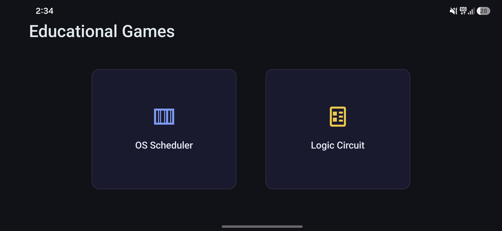
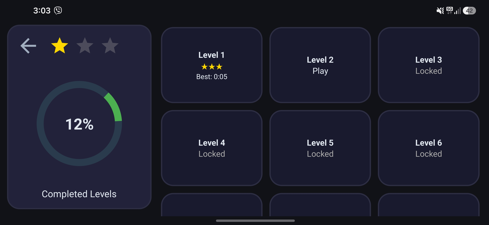
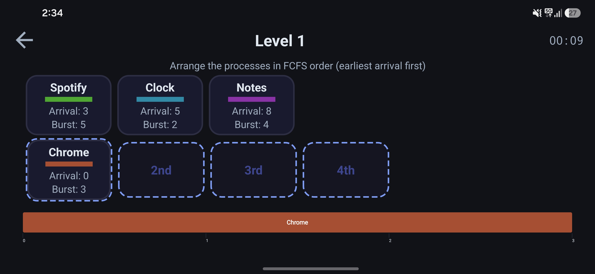
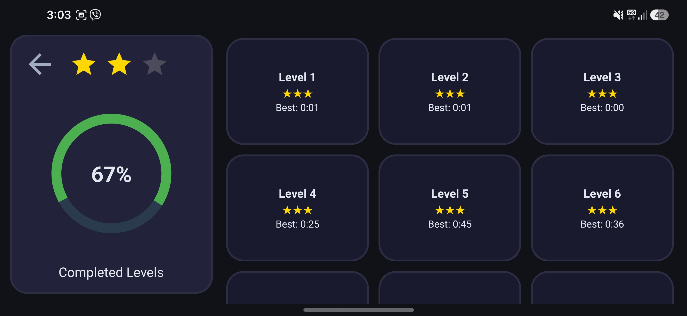
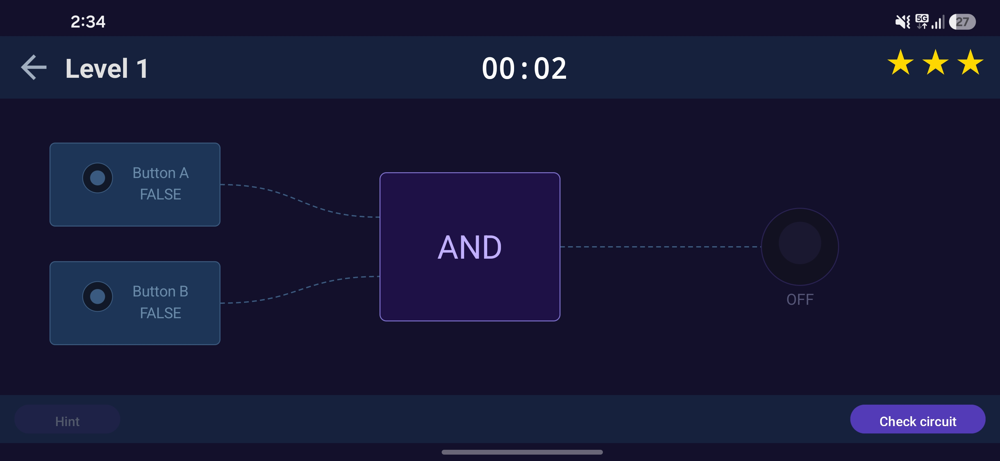

# Logic OS


An educational Android game app that teaches operating system CPU scheduling algorithms and boolean logic gates through interactive puzzles. Players progress through 18 timed levels across two games, earning up to 3 stars per level based on completion speed.

## Screenshots











## Games

### OS Scheduler

Learn 5 CPU scheduling algorithms through drag-and-drop puzzles. Arrange processes into the correct execution order to build a Gantt chart.

| Levels | Algorithm                          | Description                                            |
|--------|------------------------------------|--------------------------------------------------------|
| 1      | **FCFS** (First Come First Served) | Processes execute in order of arrival                  |
| 2–3    | **SJF** (Shortest Job First)       | Shortest burst time among arrived processes goes first |
| 4–5    | **LJF** (Longest Job First)        | Longest burst time among arrived processes goes first  |
| 6–7    | **Priority**                       | Highest priority among arrived processes goes first    |
| 8–9    | **Round Robin**                    | Fill time slots with the correct process (quantum = 2) |

Each level presents named processes (Chrome, Spotify, VSCode, etc.) with arrival time, burst time, and (where applicable) priority values. Drag them into the correct execution slots.

### Logic Circuit

Learn boolean logic gates (AND, OR, NOT) through three progressive gameplay modes across 9 levels.

| Levels | Mode                | Gameplay                                                                              |
|--------|---------------------|---------------------------------------------------------------------------------------|
| 1–3    | **Toggle**          | Tap input buttons to toggle signals through a single gate and light the bulb          |
| 4–6    | **Wire Connection** | Drag wires between pre-placed components to connect the circuit                       |
| 7–9    | **Free Build**      | Place gates and buttons on a canvas, wire them up, and build the circuit from scratch |

## Features

- **18 levels** across two games with progressive difficulty
- **Star-based scoring** — earn 1–3 stars per level based on completion time
- **Best time tracking** — shows the best completion time per level on the level-select screen
- **Sequential unlocking** — complete a level to unlock the next
- **Progress tracking** — circular progress bar showing overall completion
- **Dynamic level grid** — level cards generated programmatically in a 3-column grid
- **Drag-and-drop** interaction for the scheduler game
- **Custom Canvas rendering** for circuit building with curved wires
- **Light and dark theme** support
- **Offline** — no internet connection required
- **Hint system** — hints unlock after 30 seconds on logic levels
- **Exact gate validation** — build-mode levels require the precise number of logic gates

## Tech Stack

| Component    | Technology                            |
|--------------|---------------------------------------|
| Language     | Java 11                               |
| Min SDK      | 24 (Android 7.0)                      |
| Target SDK   | 36                                    |
| Build        | Gradle with version catalog           |
| UI           | Material 3, custom Canvas-based Views |
| Persistence  | Room 2.8 (SQLite)                     |
| Architecture | Activity-based, MVP-like              |

## Getting Started

### Prerequisites

- JDK 11+
- Android Studio (latest stable recommended)
- Android SDK with API 36


```bash
git clone https://github.com/mario-gurmeshevski/multi_game_dashboard.git
cd multi_game_dashboard
./gradlew assembleDebug
```

Open the project in Android Studio and run on an emulator or device (API 24+).

### Release Build

Release builds require signing keystore and environment variables:

```bash
export SIGNING_STORE_PASSWORD=<your-keystore-password>
export SIGNING_KEY_ALIAS=<your-key-alias>
export SIGNING_KEY_PASSWORD=<your-key-password>
./gradlew assembleRelease
```

Optionally override version info:

```bash
export VERSION_CODE=5
export VERSION_NAME=1.9.0
```

## Project Structure

```
app/src/main/java/com/example/educationgame/
├── MainActivity.java                          # Dashboard with game selection cards
│
├── common/
│   ├── BaseLevelSelectActivity.java           # Abstract base for level-select screens
│   └── LevelCompleteDialog.java               # Star rating dialog on level completion
│
├── logic/
│   ├── LogicActivity.java                     # Level select (9 levels, extends Base)
│   ├── LogicLevelPlayActivity.java            # Gameplay host (timer, hints, validation)
│   ├── LogicEngine.java                       # Gate evaluator (AND, OR, NOT)
│   ├── LogicLevelConfig.java                  # Level config POJO
│   ├── LogicLevels.java                       # Static registry of 9 level configs
│   ├── LogicGameView.java                     # Canvas view — toggle mode (levels 1–3)
│   ├── LogicWireView.java                     # Canvas view — wire mode (levels 4–6)
│   ├── BaseCircuitView.java                   # Abstract base for Wire & Build views
│   ├── LogicBuildView.java                    # Canvas view — build mode (levels 7–9)
│   └── LevelTaskDialog.java                   # Pre-game task popup with countdown
│
├── scheduler/
│   ├── SchedulerActivity.java                 # Level select (9 levels, extends Base)
│   ├── LevelSchedulerPlayActivity.java        # Gameplay host (drag-and-drop, timer)
│   ├── SchedulerSolver.java                   # Algorithm engine (FCFS, SJF, LJF, etc.)
│   ├── SchedulerDragController.java           # Drag-and-drop logic & validation
│   ├── ProcessSquareFactory.java              # Creates process card & slot views
│   └── GanttChartView.java                    # Custom view — Gantt chart timeline
│
└── data/
    ├── enums/
    │   ├── GameTypeEnum.java                  # LOGIC, SCHEDULER
    │   └── SchedulingAlgorithm.java           # FCFS, SJF, LJF, PRIORITY, ROUND_ROBIN
    ├── scheduler/
    │   ├── SchedulerLevels.java               # Static registry of 12 level configs
    │   ├── ProcessColorGenerator.java         # HSV-distributed colors for process bars
    │   ├── LevelStarConfig.java               # Star time thresholds per level
    │   └── model/
    │       ├── LevelConfig.java               # Scheduler level config POJO
    │       ├── ProcessDef.java                # Process definition (name, arrival, burst)
    │       ├── ProcessInfo.java               # Process with color & remaining burst
    │       └── RoundRobinResult.java          # Round Robin schedule output
    └── local/
        ├── AppDatabase.java                   # Room database singleton (v5)
        ├── AppExecutors.java                  # Single-thread ExecutorService for I/O
        ├── Converters.java                    # Room TypeConverters
        ├── DatabaseMigrations.java            # Migration v4 → v5
        ├── dao/
        │   ├── GameDao.java                   # Game CRUD
        │   ├── LevelDao.java                  # Level CRUD
        │   └── LevelProgressDao.java          # Progress CRUD (best score per level)
        └── entity/
            ├── GameEntity.java                # Game table (id, type, title, description)
            ├── LevelEntity.java               # Level table (id, levelNumber, gameId FK)
            └── LevelProgressEntity.java       # Progress table (id, levelId FK, score, time)
```

## License

This project is licensed under the MIT License — see the [LICENSE](LICENSE) file for details.
